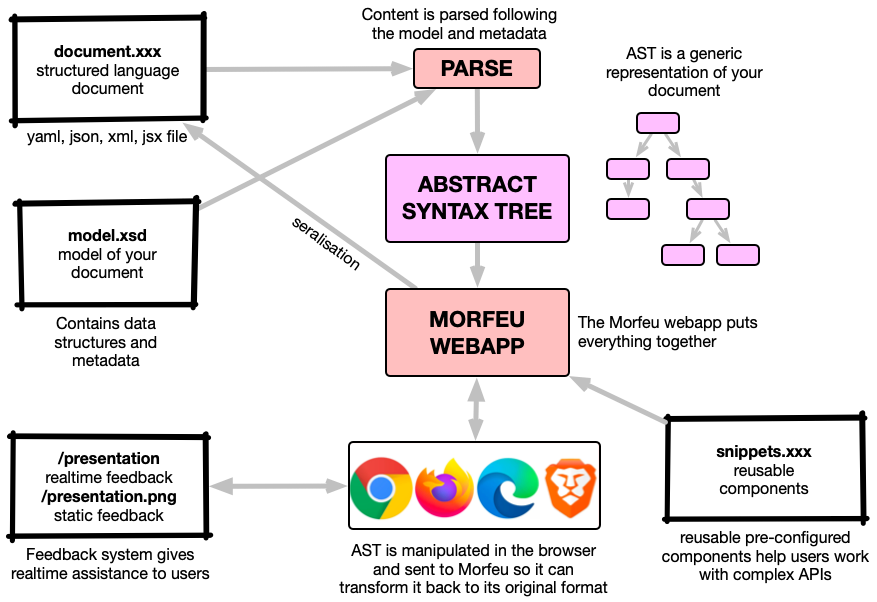
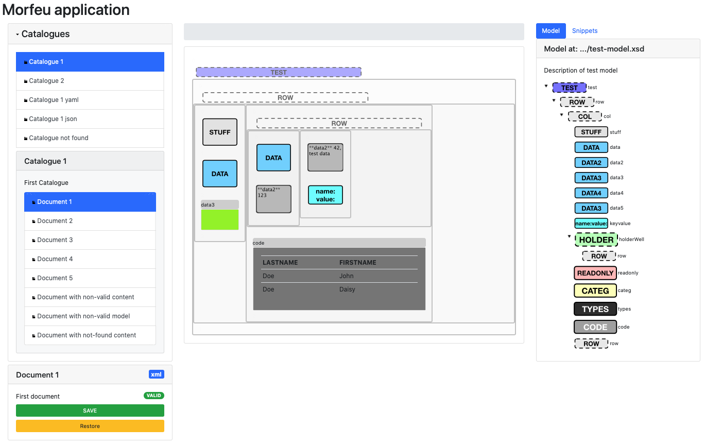
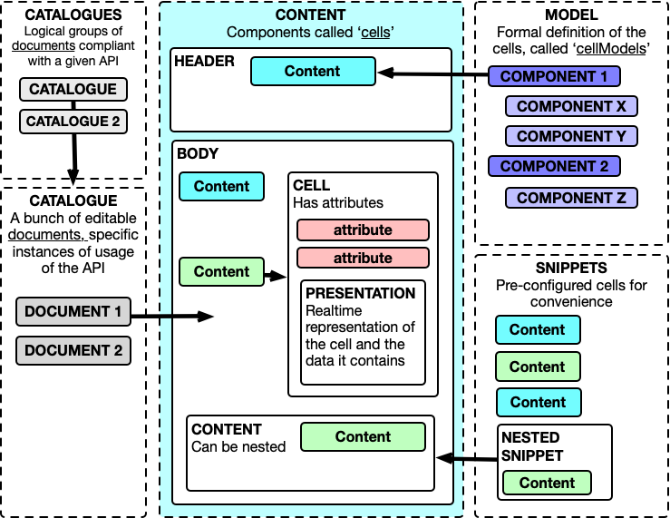
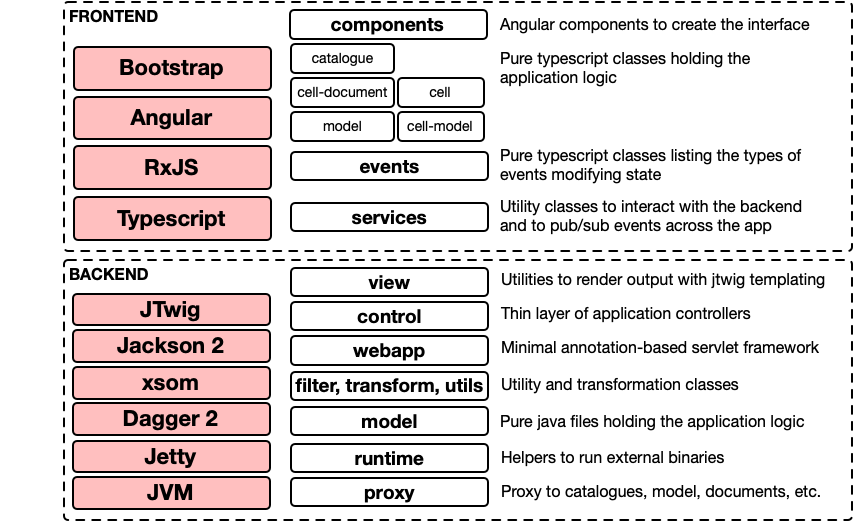

# Morfeu

Morfeu is an application to visually manage APIs represented as [YAML](http://yaml.org), 
[JSON](https://www.json.org/json-en.html), [JSX](https://facebook.github.io/jsx/) or [XML](https://www.w3.org/XML/) 
documents. APIs are defined formally and enriched with metadata, which enables Morfeu to present a practical generic UI. 
Morfeu treats the original document as source of truth, is fully compatible with manual editing, git workflows and 
requires no dependencies in the API implementation.

YAML and JSON-based APIs are commonly used in many domains to represent complex API configurations, and Morfeu makes it
easier for users to engage and experiment with those APIs. Using a microservices approach, other services can be 
developed and run a a sidecars to support different environments, systems and APIs. The sidecars in question are 
lightweight layers that are ran alongside existing complex systems.

- [snow-package](https://github.com/danigiri/snow-package) is a demo project that lets you manage pages written in JSX, 
  for instance your typical React web application. An example site can be found in the
  [snowpackage-site](https://github.com/danigiri/snow-package) repo, which implements a trivial test site.
- [eurinome](https://github.com/danigiri/eurinome) is another project that applies the Morfeu concept to the Kubernetes
  ecosystem using Helm

Morfeu is flexible and can work with any YAML, JSON or XML API once a schema is for that API is created and added to the 
system. It can even work with JSX markup code given it is an structured language that can be parsed.

It is licensed under the Apache 2 open-source license and is under heavy development.

## Getting Started

### Using Docker
```
git clone https://github.com/danigiri/morfeu.git
cd morfeu
docker build -t morfeu .
docker run --rm -p 8980:8980 morfeu
# if using a maven central repository mirror (reposilite example)
docker build -t morfeu  --build-arg MAVEN_CENTRAL_MIRROR=http://reposilite.local.test/maven-central  --add-host=reposilite.local.test:192.168.1.30 .  && docker run --rm -p 8980:8980 morfeu

```

### Manually
```
# clone the project
git clone https://github.com/danigiri/morfeu.git
# install maven, npm and angular and then...
cd morfeu
# Start the backend (notice that we are setting an java env var to point to our location)
export MAVEN_OPTS=--add-opens=java.base/java.util=ALL-UNNAMED
mvn clean compile jetty:run -D__RESOURCES_PREFIX=file://$(PWD)/ &
# launch the frontend
cd src/main/typescript && npm install && npm start
# This will open a browser with the application on http://localhost:3000
```

### Deploying on Kubernetes
Follow the same steps for Docker and use the generated image (example below is for a local microk8s cluster).

```
docker tag morfeu 127.0.0.1:32000/morfeu
docker push 127.0.0.1:32000/morfeu
# examine dashboard
http://<ip>:8080/api/v1/namespaces/kubernetes-dashboard/services/https:kubernetes-dashboard:/proxy/#/login
```


## Demo

[](https://youtu.be/jiqDp8Wzsjs "Morfeu introduction")

In this short video we showcase a Morfeu editing session with a simple YAML-based API.


## How it works

### Main idea



As shown in the diagram, YAML, JSON, XML, or JSX files or  _documents_  are parsed into an [Abstract Syntax Tree](https://en.wikipedia.org/wiki/Abstract_syntax_tree) and presented to the user as a generic drag and drop UI, the UI can have a realtime interactive feedback loop when manipulating the different elements of the API. When the user is satisfied the document content is OK the AST is converted back to its original format.

### How it looks



On the left panel we have the catalogue list, the list of documents of the selected catalogue and some information on the currently open document. In the middle we have the content with the cellsbeing manipulated. On the right hand side we have both the current document model as well as a tab to access the snippets of the current catalogue.

### Conceptual model



A description of the different elements follows:

#### Catalogue

Logical grouping of documents of a given API, it is expected all documents contained share the same API, model,
preview functionality, etc. It will also contain a list of snippets for convenience. Catalogues are defined as simple JSON files. The include a list of documents and a list of snippets.

#### Document

A document is an instances of an usage of an API, DSL or abstraction layer, it is composed of a number of cells, containing attributes, values, etc. The basic information of a document is defined as a JSON file but the content is represented as a YAML, JSON, XML or JSX blob (can be stored in a file or come from a configurable endpoint) that is controlled by the API owner.

### Snippet

Convenience fragment of a document, with pre-filled values. Useful as a starting point for complex API usage and for begginner users. Necessarily tied to the model though it may not always validate (given it may be a fragment that needs to sit within a given structure). The basic information of a snippet is stored in a plain JSON file but the actual content is a YAML, JSON, XML or JSX blob that is expected to follow the specified model.

#### Model

Model represeting an API, a DSL or an abstraction layer, its implementation is completely up to the API owner but Morfeu requires the owner to create a bunch of [XML Schema](https://www.w3.org/TR/xmlschema11-1/) definition files with some extra metadata to assist in the presentation and (de)-serialisation of the document contents handled by the application. Can be though of the  _schema_  of the API and is totally controlled. A subset of the XML Schema is used for implementation and definition simplicity.

#### CellModel

Definition of specific  _cells_  within the model, what values and attributes they can take, if they have children, etc. The definition includes how the cell is presented to the user in Morfeu, a description, possible values (regexp), if it has attributes the type and ordering of any children it may have in the model. It is designed to be very flexible and accommodate many scenarios like recursive definitions, format specific serialisation directives, specific cardinality, inheritance, type reusability, etc.

#### Type

Low level types as defined in the model, like integers, strings, etc.

#### Metadata

Extra information added to CellModels to increase their usability and other functions like helping with (de)-serialisation, formatting, etc.

#### Cell

Specific instance of an API object within a document, must comply with a specific cell model, it can include values, attributes and children cells.

### Software components



In the frontend, events are used to change the state of components and inter-component message passing. Also, the application specific logic is contained in pure Typescript classes that have no external dependencies. Frontend components are also standalone and extensively tested using Selenide test suites.

In the backend, dependency injection is used extensively to break down application logic, provide encapsulation, etc. Components can be extended and or their implementation changed with relative ease. There is an extensive number of integration and unit tests.


## Rationale

APIs are complex to design, develop and use. Many organisations have an ever-growing list of APIs that gets bigger and bigger over time, sometimes are poorly-documented, with contracts that are hard to use for novices and challenging for experts. This problem is exacerbated when APIs are acting in combination, or they are produced by different teams with different styles, granularity levels, etc.

Often, organisations employing rich internal APIs end up developing a custom UI (often browser-based) that makes it easier to interact with that API and increase productivity. This is a valid strategy, but rich APIs are complex to develop and maintain, also requiring specific sets of skills that typical backend API developers may not have. In practice, building a complex UI for every single API is too resource and time-consuming, restricting the feasibility of developing custom UIs to the most popular APIs. 

This problem is compounded when the underlying systems interact between themselves or expose complex semantics. It is even more complex to create all-encompassing or modular UIs that handle APIs created by different teams, crossing domain and organisational boundaries.

Morfeu proposes a generic browser-based UI to handle multiple APIs at the same time, maintaining boundaries and making it easier for engineers to test and interact with YAML, JSON and XML-based APIs (other formats can be added as long as there is a way to transform to and from a DOM-like tree structure). It is designed to be very flexible and JSX support was added with minimal effort.

## Development

### Dependencies

Morfeu requires [Java 20](https://java.com/en/download/), [Maven](http://maven.apache.org), [Angular 10](https://angular.io) and [npm](https://www.npmjs.com). [Selenium](https://www.seleniumhq.org) is used for browser integration tests. A [dockerfile](./Dockerfile) is available for convenience.

### Tests

Morfeu includes a fair number of unit and integration tests. Launch the following command to run them:

    mvn test failsafe:integration-test -Dit.test='*IntTest' -Dapp-url='http://localhost:3000/'

This will run unit tests and general integration tests (see next command for UI ones). As there is a fairly large number of them this will take some time.

To launch UI Selenium integration tests you can do:

    mvn test failsafe:integration-test -Dit.test='*UITest' -Dapp-url='http://localhost:3000/'

To use Firefox you can do something like (Ubuntu snap installation):
    mvn test failsafe:integration-test -Dit.test='*UITest' -Dapp-url='http://localhost:3000/' -Ddriver=firefox -Dwebdriver.gecko.driver=/snap/bin/geckodriver

A small number of frontend tests is also available, to launch them you can do:

    cd src/main/angular && ng test


### Releasing

Using the maven release plugin and using the local repository to leave the artifact, this will create a release in GitHub.

     mvn -B release:prepare release:perform -Darguments=" -Dskip-build-client=true -DskipITs -Djetty.skip -DaltDeploymentRepository=REPO::default::file://$HOME/.m2/repository"

Note this runs a limited number of tests, so the above integration tests should be ran before doing a release

## Contributing

PRs or issues are welcome. Morfeu is under heavy development.

## Authors

Daniel Giribet - Twitter: [@danielgiri](https://twitter.com/danielgiri)

## License

> Copyright 2024 Daniel Giribet
>
> Licensed under the Apache License, Version 2.0 (the "License");
> you may not use this file except in compliance with the License.
> You may obtain a copy of the License at

>   http://www.apache.org/licenses/LICENSE-2.0

> Unless required by applicable law or agreed to in writing, software
> distributed under the License is distributed on an "AS IS" BASIS,
> WITHOUT WARRANTIES OR CONDITIONS OF ANY KIND, either express or implied.
> See the License for the specific language governing permissions and
> limitations under the License.

## Acknowledgements

